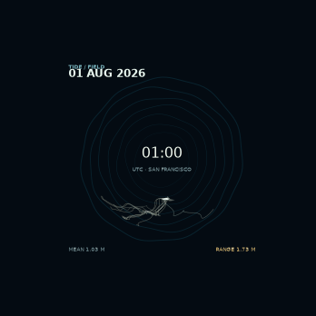
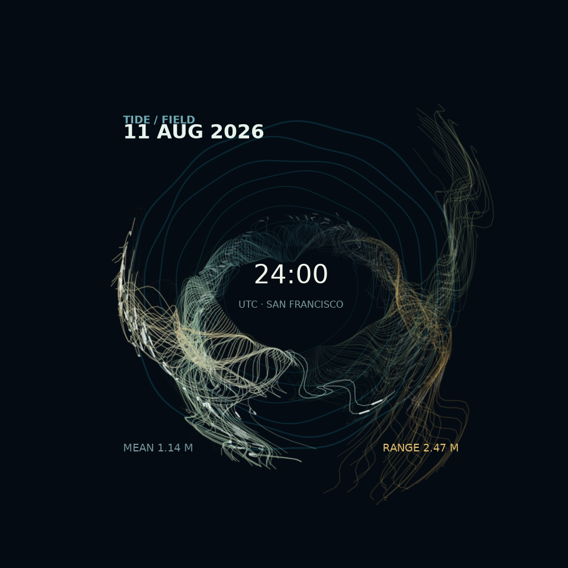

# Tidal mycelium — San Francisco water levels





## The phenomenon

The sea surface at San Francisco rises and falls in a pattern shaped mostly by the gravitational pull of the Moon and Sun. Local weather, wind, pressure and the geometry of the bay also affect the measured level. I chose a month of this motion because the tide is both predictable and visibly irregular: a clock can show its repeating rhythm, while the changing height and rate of change give each day a different character. The animation treats those measurements as a slowly growing field of water-borne threads rather than as a conventional chart.

## The source

The raw file is a response from the [NOAA CO-OPS Data API](https://api.tidesandcurrents.noaa.gov/api/prod/datagetter?begin_date=20260801&end_date=20260831&station=9414290&product=water_level&datum=MLLW&time_zone=gmt&units=metric&application=TidesAndCurrentsAssignment&format=json)
for San Francisco station 9414290.
It is committed unchanged as
`data/noaa-san-francisco-water-level-2026-08.json`. It contains 7,440 rows:
one observed water-level record every six minutes from 1 to 31 August 2026.
Each row has `t` (UTC time), `v` (water level in metres above Mean Lower Low
Water, MLLW), `s` (sample standard deviation), `f` (quality flags), and `q`
(quality status). The station metadata identifies the location as San Francisco,
California.

## What the picture shows

Each day begins at midnight and its 240 observations appear hour by hour. Time sets the thread's source position, water level controls its reach, thickness and teal-to-gold colour, and the six-minute change in water level bends its flow. New records carry a bright particle dash; the previous day remains as a faint memory and dissolves while the next day grows. Daily mean level and tidal range reshape the larger water ripples behind the field.

This transformation hides the familiar Cartesian time axis, the exact geography of the station, and the physical causes of every deviation from the tide. It also turns a six-minute reading into an artistic path, so it should not be used for navigation or for reading an exact water level from the image.

## Data-to-image mapping

| NOAA value | Visual use |
| --- | --- |
| `t` — UTC timestamp | Determines the thread's position around the circular clock and the order in which it appears. |
| `v` — water level (m above MLLW) | Sets the source radius, trail reach, line width, and teal-to-gold colour. |
| Adjacent `v` values | Their six-minute difference determines the curve's signed bend; rising readings also receive a cyan tint. This is a rate-of-change cue, not measured current direction. |
| Daily mean and range of `v` | Derived values that change the field's centre, overall spread, and the scale and distortion of the background ripples. |
| `f` — quality flags | Any non-zero flag makes the associated thread substantially fainter. |
| `q` — quality status | Verified readings are clearer; other statuses are muted. Every row in this file is `v`, so this particular channel does not vary. |
| `s` — sample standard deviation | Read from the JSON but not mapped: all records have the same `0.028` value, so it carries no visual variation. |

The glowing particle dash and the gradual fade are animation devices. They use the observation's timestamp and age in the animation, but are not additional
measurements.

## Run

```bash
uv run plot.py
```
