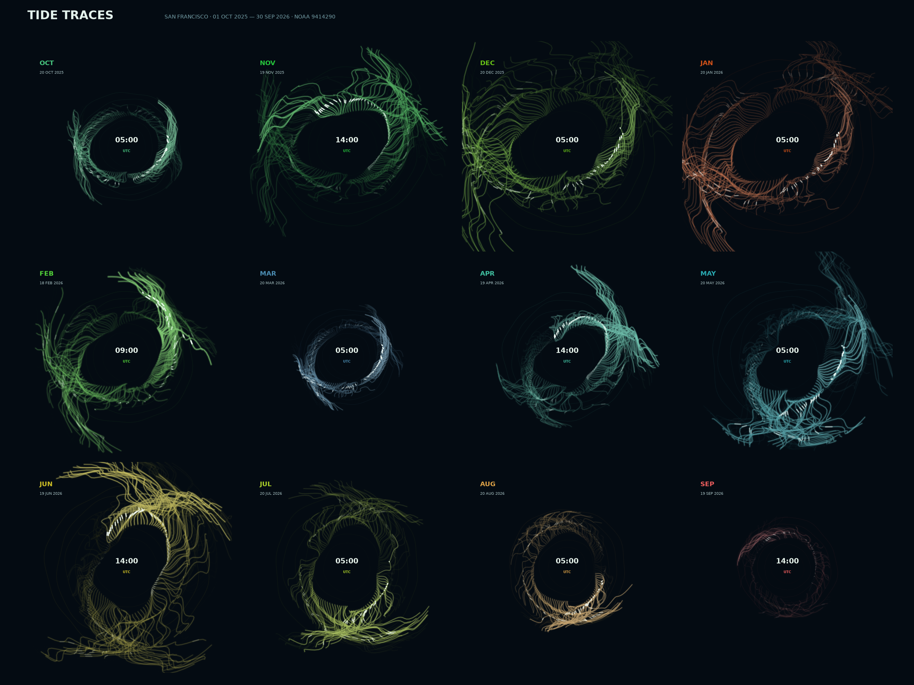

# Tide Traces — San Francisco, one year, twelve fields

The water at San Francisco does not simply rise and fall at the same height
every day. The Moon and Sun drive the tide, while weather and the shape of the
bay alter what arrives at the gauge. This repository takes one complete year
of six-minute NOAA observations, puts each month in its own circular flow
field, and replays all twelve months together.

It is one published collection of numbers about a natural phenomenon, a
picture that could not be drawn by hand, and every transformation written down.

**The live page:** <https://yinuozhang0210.github.io/Tides-and-Currents/> —
click a field, choose a UTC date, change the line form, or let all twelve
months play.

## The phenomenon

San Francisco normally has two high and two low waters a day, but the height
and range of those tides change across the lunar cycle. The data cover 01
October 2025 to 30 September 2026: 365 days in which a high-energy December
or January field can sit beside a tighter, quieter March or September field.
The 3 × 4 layout preserves calendar order from October to September while
letting every month show its own daily rhythm.

## The source

[NOAA Tides and Currents](https://tidesandcurrents.noaa.gov/), run by the
Center for Operational Oceanographic Products and Services (CO-OPS), publishes
observed water levels for San Francisco station 9414290. Its API returns one
raw JSON reply per calendar month:

    https://api.tidesandcurrents.noaa.gov/api/prod/datagetter?begin_date=YYYYMM01&end_date=YYYYMMDD&station=9414290&product=water_level&datum=MLLW&time_zone=gmt&units=metric&application=TidesAndCurrentsAssignment&format=json

The observed water-level product permits at most 31 days in one reply.
fetch.py asks once for each of the twelve months, saving every raw reply in
data/. Together they contain 87,600 rows: one six-minute observation at one
gauge, with t (UTC timestamp), v (water level in metres above MLLW), s (sample
standard deviation), f (quality flags), and q (quality status). The committed
file [data/noaa-san-francisco-water-level-2025-10.json](data/noaa-san-francisco-water-level-2025-10.json)
is the first reply; the other eleven have the same name pattern. Later runs
find those cached files and make no network request.

## The pictures

| Command | Makes | What it is |
|---|---|---|
| uv run plot.py | out/tide-traces-year-2025-10-to-2026-09.gif, out/tide-traces-year-still.png | A 144-frame, 3 × 4 animation. Each monthly field advances from its first to last UTC day; at three frames per second, the full loop is 48 seconds. |
| uv run web.py | site/index.html | The same twelve fields as a self-contained Canvas page. At 1.00×, a full monthly loop lasts 120 seconds; clicking a field and choosing a date pins just that month. |

The GIF samples every other six-minute observation and the browser samples
every third. The source files remain unchanged; this is the visual sampling
that keeps twelve simultaneous fields readable.

**What the pictures show:** Time sets a trace around a circular clock, v sets
its reach and brightness, and the difference from the preceding v bends it.
Month mean, full-month span, and average daily range set the field scale,
ripples, saturation, and hue. The resulting grid makes twelve related tidal
climates visible at once: dense, expanded coloured fields for larger tidal
ranges and compact fields for quieter months.

**What they hide:** The animation replaces axes, exact labels, geography, and
causal explanation with a field of marks. It shows a sampled rendering rather
than every source row, and its arcs and white particles are not observed current
paths. The monthly hue is a rank of measured mean height and tidal energy, so
it distinguishes fields clearly but is not another NOAA variable.

## How it works

Three functions, each a transformation, and a loop over 144 moments:

- observations(path) reads a raw NOAA reply, retaining all five published
  fields; a blank s remains a missing value instead of dropping the row.
- month_profiles(months) calculates each month's mean water level, full span,
  and average daily range, then ranks their combined signal for the visible
  colour palette.
- filament_collections(...) turns an observation into a fading curve: t gives
  its clock angle, v gives reach and width, six-minute change gives bend, s
  gives halo, and f and q reduce opacity.

main() loops through the 144 frames; draw_grid() loops through the twelve
months for every frame. The adjustable constants are close to the top of
plot.py and web.py. The Pages workflow runs web.py after each push and publishes
site/, which is output and is never committed.

## Run it

~~~bash
uv run plot.py
~~~
